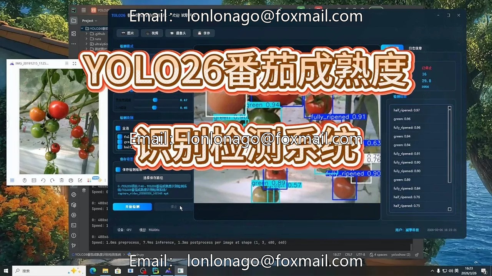
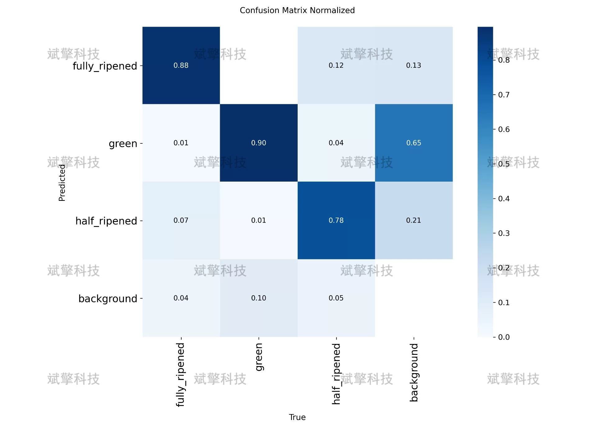
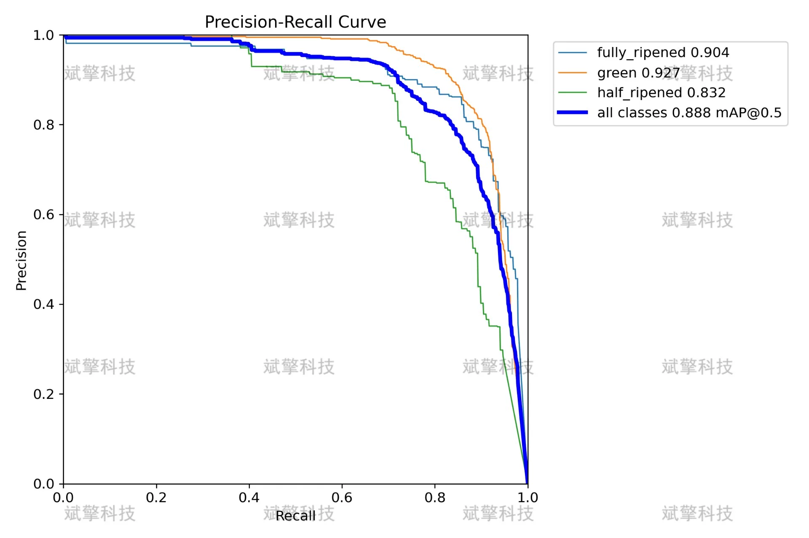
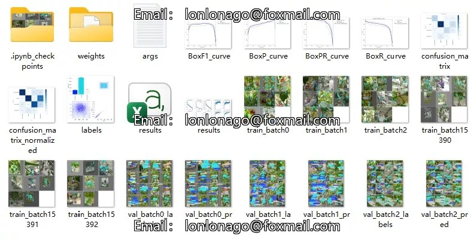
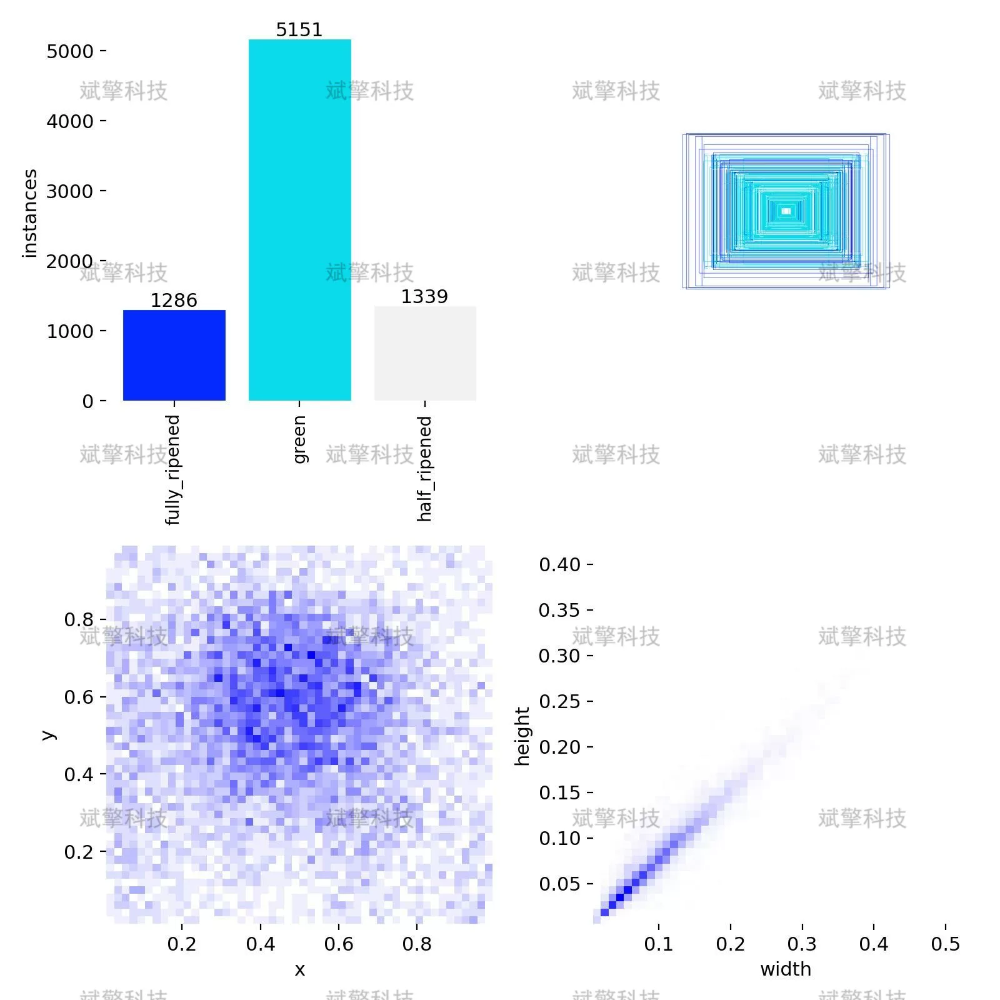
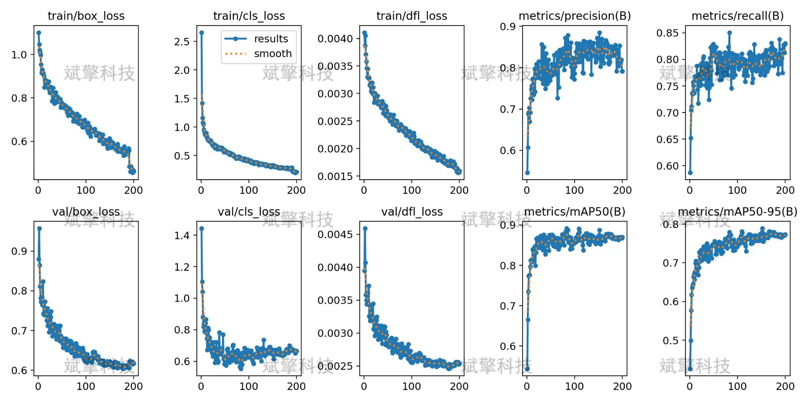
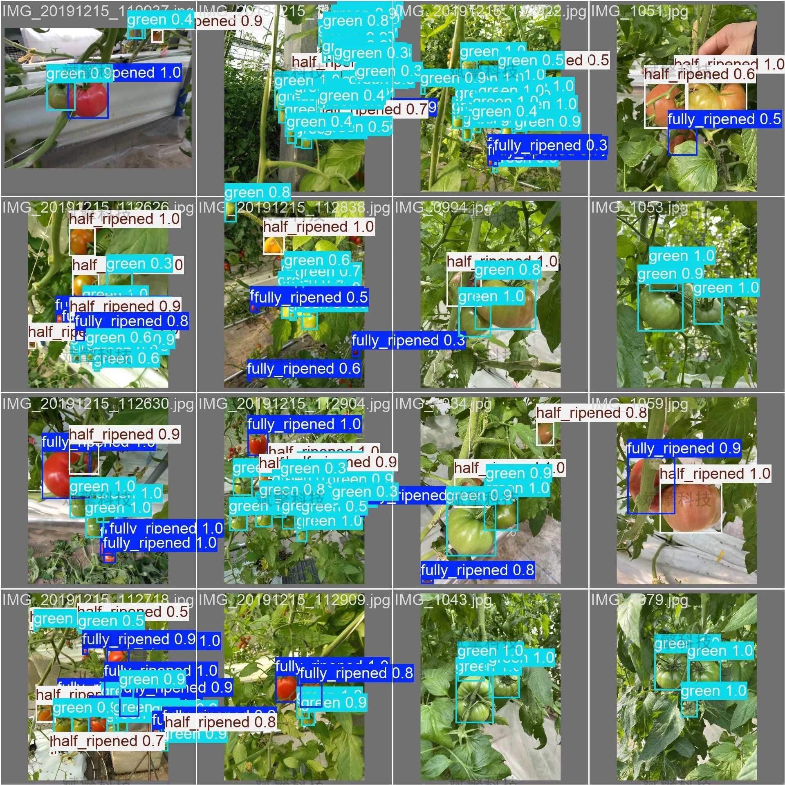
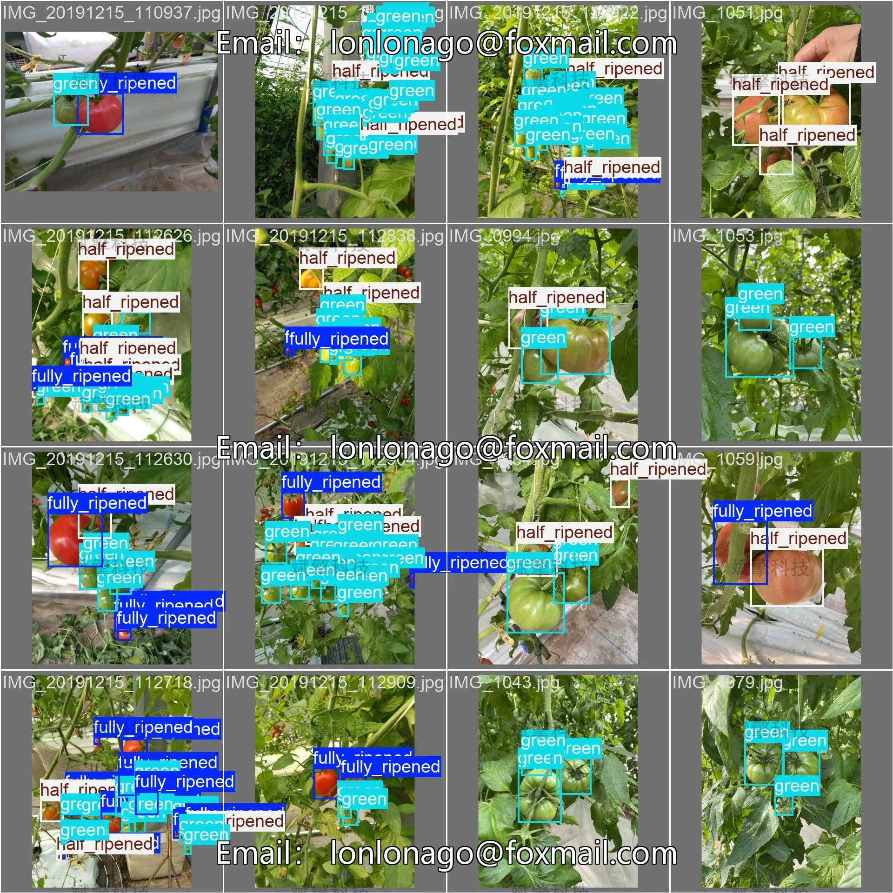

# YOLO26 Tomato Maturity Recognition System | Dataset

## Body

YOLO26 Tomato Maturity Identification System | Dataset YOLO26 Aids Intelligent Agriculture: Tomato Maturity Identification System Design and Implementation (Full Maturity/Semi-Mature/Unripe)

This system is based on the YOLO26 object detection algorithm, conducting in-depth research and implementation for the automatic identification task of tomato maturity. The identification of tomato maturity holds significant application value in intelligent agriculture, automated picking, and product sorting. The system categorizes tomato maturity into three categories: fully ripened (fully_ripened), green unripe (green), and semi-ripe (half_ripened). The experimental dataset consists of 804 labeled images, divided into a training set (643), validation set (80), and test set (81) at a ratio of 8:1:1. Through training and evaluation with the YOLO26 model, the system achieves an mAP50 metric of 0.83, a recall rate of 0.94, and an F1 score of 0.83. The experimental results indicate that the model can effectively identify tomatoes of different maturities. This study provides a feasible technical solution for tomato automated sorting and intelligent picking systems.

The dataset used in this study was captured under natural lighting conditions, featuring tomato images according to the color changes characteristic during maturation, categorizing maturity into three categories:
fully_ripened (fully_ripened): Fruits are red or dark red, reaching the optimal eating and picking state
green (green): Fruits are green or light green, not yet turning color
half_ripened (half_ripened): Fruits are in the transitional stage from green to red or orange, pink, or other transitional colors

Total dataset volume: 804 labeled images
Training set: 643 (80% of total)
Validation set: 80 (10% of total)
Test set: 81 (10% of total)

Free appointment for remote installation. Unsuccessful installation will result in full refund.
Purchase includes the following resources (accessed via Baidu Cloud):
- YOLO recognition detection project complete source code
- YOLO format dataset
- Training code + UI interface code
- Trained model + results image
- Software installation package
- Add WeChat to make an appointment for remote installation (automatically displayed WeChat ID after purchase) - Unsuccessful, full refund

⚙️ Core function modules
Detection capabilities
- Image detection: Upon upload, returns detection boxes + category information
- Video detection: Supports video files, analyzing frames accurately
- Camera real-time detection: Connects to USB cameras, achieving dynamic monitoring
Interaction and control
- Target filtering: Choose one or more categories for detection
- Real-time adjustment of parameters: Adjustable confidence threshold & IoU threshold, flexible control of precision
- Results saving: One-click save of images/videos/camera detection results
System and data
- User login registration: Supports password strength checking + encryption storage
- Log recording: Automate operation and error information recording (timestamped)

## Images

## Payment

Here is a pay link on Stripe ( https://buy.stripe.com/3cs8yP7sY87d0vu9AB ). Please contact me lonlonago@foxmail.com after funding $89, and I will send you a complete data files , thank you!

